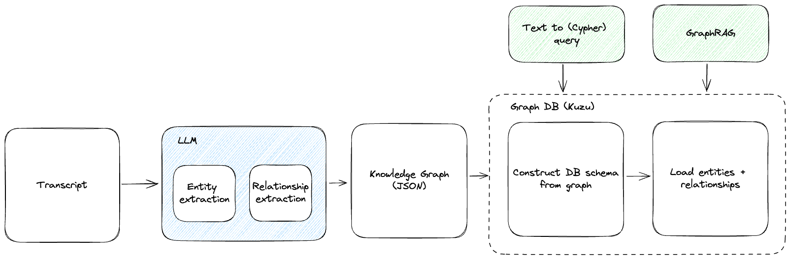

# Building a podcast knowledge graph with LLMs



## Getting started

```shell
$ pnpm install
```

Edit `.env` and set the `OPENAI_API_KEY` environment variables.

The script `src/index.ts` will read the transcript from `examples/output.json` and use the `buildGraph` function to build a knowledge graph:

```shell
$ pnpm exec tsx src/index.ts
```

The raw knowledge graph will be written to `kg.json` and the knowledge graph in DOT format will be written to `kg.dot`.

If you have [Graphviz](https://graphviz.org/) installed, you can visualize the knowledge graph with:

```shell
$ dot -Tpng -o kg.png kg.dot
```

## Loading results into a graph DB

Standalone JSON files of the knowledge graph are not very useful by themselves. We need to be able to query the graph and do more complex operations. For this we'll use the.
[Kuzu](https://kuzudb.com/) graph database.

Unlike Neo4J and some other graph DBs, Kuzu requires a database schema to be defined up front. We'll use the actual KG constructed by the LLM combined with the node definitions in our `src/schema.ts` file to define the schema.

The database specific code is in `src/db.ts` and a wrappre script to load the KG into the database is in `src/indexer.ts`:

```shell
$ npx tsx src/indexer.ts
```

You can connect to the database with the Kuzu CLI:

```shell
$ kuzu ./demo_db
```

And run any Cypher query it supports, for example, finding all the relationships between the "Perplexity" organization and any node:

```cypher
MATCH (o:Organization)-[r]->(n) WHERE o.label = 'Perplexity' RETURN r,n;
```

## Notes

This is a very naive approach, missing some very basic things like:

- Chunking -- if the transcript is too long for the context window of the model we're calling, we'll get an error
- Prompts -- pretty basic prompt, we can improve it a lot, include context on our goals/constraints/domain/etc.
- Relationship directions -- the LLM doesn't always get it right and we haven't hinted it to tell it what direction to go in
- Relationship/node constraints -- we haven't provided any hints to the LLM to tell it what types of relationships are allowed between which node types.

The models don't do a great job of respecting enums and discriminated unions in the schema. They generally follow the union for the node types but sometimes add other types so we can't use the discriminated union or risk rejecting the output, same with the string enum for the edge types. Instead of enforcing edge types to be one of the allowed values, we just allow any string and give it examples of what we allow in a description.

The more robust approach lists node/edge types explicitly in addition to the JSON schema. If you want to write code that let's you define the graph schema and automatically get all this synced up and validated, use [Caden AI](https://cadenai.com/) 😀.
